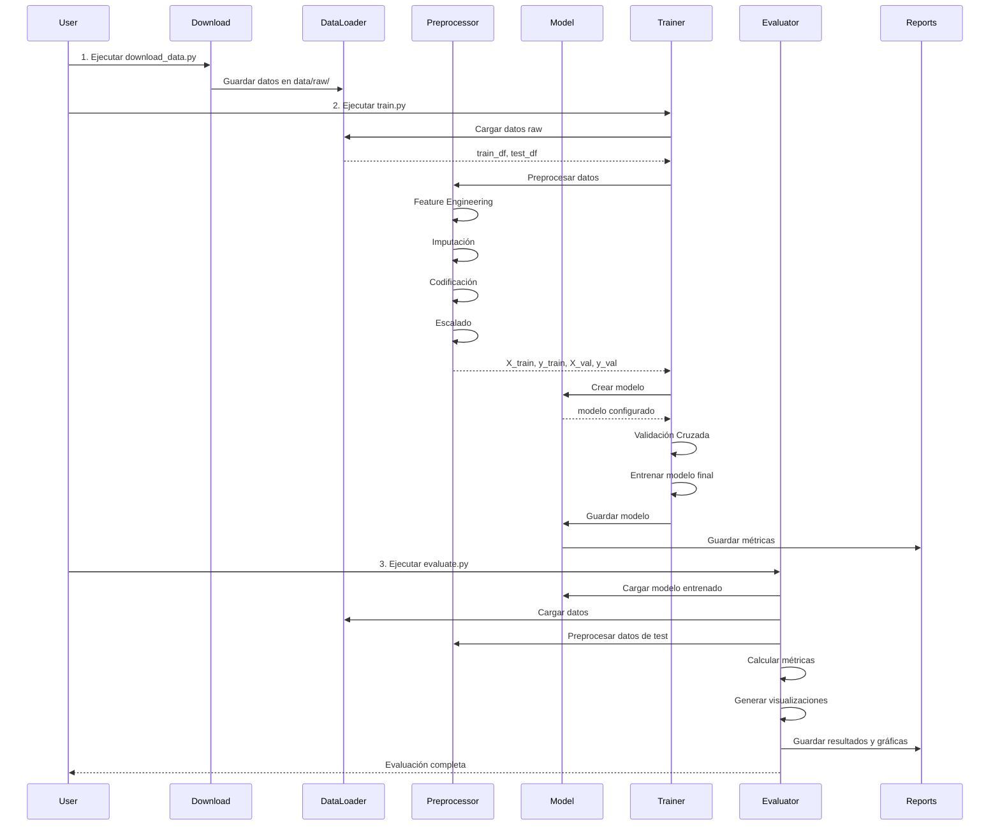
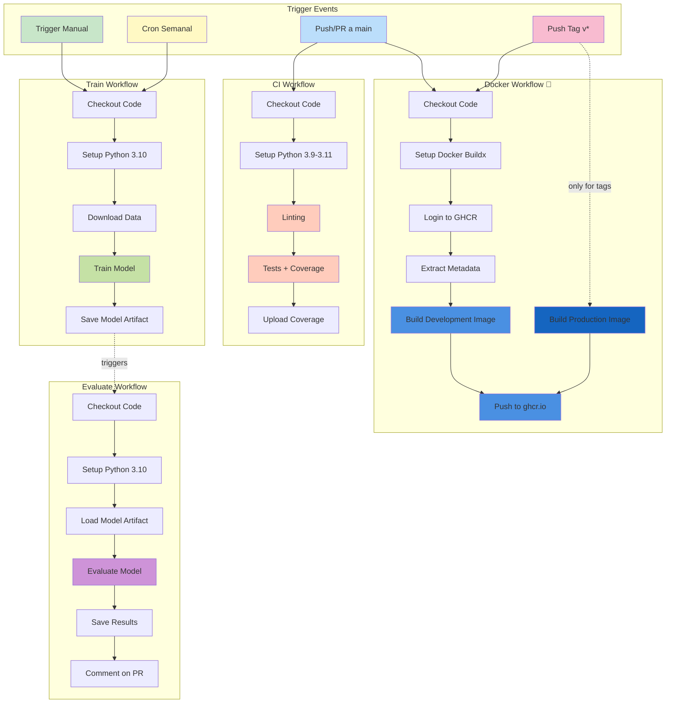
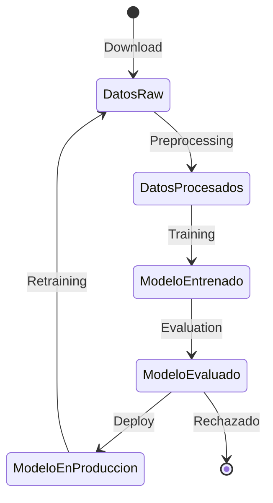

# 🏗️ Arquitectura del Proyecto Titanic ML

## Índice

- [Visión General](#visión-general)
- [Diagrama de Arquitectura](#diagrama-de-arquitectura)
- [Componentes Principales](#componentes-principales)
- [Flujo de Datos](#flujo-de-datos)
- [Decisiones de Diseño](#decisiones-de-diseño)
- [Estructura de Directorios](#estructura-de-directorios)

## Visión General

Este proyecto implementa un pipeline completo de Machine Learning para predecir la supervivencia de pasajeros del Titanic, con énfasis en buenas prácticas de ingeniería de software, testing automatizado y CI/CD.

### Principios de Diseño

1. **Modularidad**: Cada componente tiene una responsabilidad única y bien definida
2. **Reutilización**: Los módulos pueden usarse independientemente o en conjunto
3. **Testabilidad**: Todo el código está diseñado para ser fácilmente testeable
4. **Automatización**: CI/CD completamente automatizado con GitHub Actions
5. **Reproducibilidad**: Semillas aleatorias fijas y versionado de modelos

## Diagrama de Arquitectura

### Arquitectura General del Sistema

```mermaid
graph TB
    subgraph "Entrada de Datos"
        DL[download_data.py]
        RAW[(data/raw)]
    end
    
    subgraph "Procesamiento"
        LOADER[data_loader.py]
        PREP[preprocessing.py]
        PROC[(data/processed)]
    end
    
    subgraph "Modelado"
        MODEL[model.py]
        TRAIN[train.py]
        MODELS[(models/)]
    end
    
    subgraph "Evaluación"
        EVAL[evaluate.py]
        REPORTS[(reports/)]
    end
    
    subgraph "CI/CD"
        CI[ci.yml]
        TRAIN_WF[train-model.yml]
        EVAL_WF[evaluate-model.yml]
        DOCKER_WF[docker-publish.yml]
    end
    
    subgraph "Testing"
        TESTS[tests/]
    end
    
    DL --> RAW
    RAW --> LOADER
    LOADER --> PREP
    PREP --> PROC
    PROC --> TRAIN
    MODEL --> TRAIN
    TRAIN --> MODELS
    MODELS --> EVAL
    EVAL --> REPORTS
    
    CI -.Testing.-> LOADER
    CI -.Testing.-> PREP
    CI -.Testing.-> MODEL
    CI -.Ejecuta.-> TESTS
    
    TRAIN_WF -.Ejecuta.-> DL
    TRAIN_WF -.Ejecuta.-> TRAIN
    
    EVAL_WF -.Ejecuta.-> EVAL
    EVAL_WF -.Usa.-> MODELS
    
    DOCKER_WF -.Build.-> DL
    DOCKER_WF -.Build.-> LOADER
    DOCKER_WF -.Build.-> PREP
    DOCKER_WF -.Publica.-> MODELS
    
    style DL fill:#e1f5ff
    style LOADER fill:#e1f5ff
    style PREP fill:#fff3e0
    style MODEL fill:#fff3e0
    style TRAIN fill:#e8f5e9
    style EVAL fill:#f3e5f5
    style CI fill:#fce4ec
    style TRAIN_WF fill:#fce4ec
    style EVAL_WF fill:#fce4ec
    style DOCKER_WF fill:#4A90E2
```



### Flujo del Pipeline de ML



### Flujo de CI/CD



### Workflows Activos

| Workflow | Trigger | Duración | Output |
|----------|---------|----------|--------|
| **CI - Testing and Linting** | Push/PR a main | ~50s | Test results + coverage |
| **Docker Build and Publish** | Push a main / Tags | ~1-2min | Docker image en GHCR |
| **Train Model** | Manual / Semanal | ~37s | Model artifact (.pkl) |
| **Evaluate Model** | Después de Train | ~44s | Metrics + visualizaciones |

## Componentes Principales

### 1. Módulo de Carga de Datos (`src/data_loader.py`)

**Responsabilidad**: Gestionar la carga y guardado de datasets

**Funciones principales**:

- `get_data_paths()`: Obtiene y crea directorios de datos
- `load_titanic_data()`: Carga datos raw del Titanic
- `save_processed_data()`: Guarda datos procesados
- `load_processed_data()`: Carga datos procesados

**Características**:

- Gestión automática de rutas relativas
- Creación automática de directorios
- Manejo de errores con mensajes informativos

### 2. Módulo de Preprocesamiento (`src/preprocessing.py`)

**Responsabilidad**: Transformar datos raw en features listos para ML

**Clase principal**: `TitanicPreprocessor`

**Pipeline de transformación**:

1. **Feature Engineering**: Crear nuevas características
   - `FamilySize`: Tamaño de la familia
   - `IsAlone`: Indicador de viaje solo
   - `Title`: Título extraído del nombre (Mr, Mrs, Miss, etc.)

2. **Imputación de valores faltantes**:
   - Age: Mediana por grupo de título
   - Fare: Mediana
   - Embarked: Moda

3. **Codificación**:
   - Label Encoding para variables categóricas
   - One-Hot Encoding para títulos

4. **Escalado**:
   - StandardScaler para variables numéricas

**Patrón de diseño**: Fit-Transform (similar a scikit-learn)

- `fit_transform()`: Ajusta transformaciones y transforma datos de entrenamiento
- `transform()`: Aplica transformaciones ya ajustadas a datos nuevos

### 3. Módulo de Modelo (`src/model.py`)

**Responsabilidad**: Definir, crear, guardar y cargar modelos

**Modelos soportados**:

- `random_forest`: Random Forest Classifier (por defecto)
- `logistic_regression`: Regresión Logística
- `gradient_boosting`: Gradient Boosting Classifier

**Funciones principales**:

- `create_model()`: Factory para crear modelos con hiperparámetros
- `save_model()`: Serializar modelo con joblib
- `load_model()`: Deserializar modelo

**Configuración**: Hiperparámetros predefinidos con posibilidad de override

### 4. Módulo de Entrenamiento (`src/train.py`)

**Responsabilidad**: Entrenar modelos y generar métricas

**Proceso**:

1. Cargar datos raw
2. Preprocesar datos
3. Crear modelo
4. Validación cruzada (k-fold)
5. Entrenamiento en conjunto completo
6. Evaluación en train y validación
7. Guardar modelo y métricas

**Salidas**:

- Modelo entrenado en `models/`
- Métricas en `reports/training_metrics.json`

**Features especiales**:

- Validación cruzada estratificada
- Feature importance para modelos basados en árboles
- Argumentos de línea de comandos

### 5. Módulo de Evaluación (`src/evaluate.py`)

**Responsabilidad**: Evaluar modelos y generar reportes

**Métricas calculadas**:

- Accuracy
- Precision
- Recall
- F1-Score
- ROC-AUC
- Confusion Matrix

**Visualizaciones generadas**:

- `confusion_matrix.png`: Matriz de confusión
- `roc_curve.png`: Curva ROC
- `feature_importance.png`: Importancia de características

**Salidas**:

- Resultados en `reports/evaluation_results.json`
- Gráficas en `reports/*.png`

### 6. Scripts de Utilidad

#### `scripts/download_data.py`

- Descarga dataset del Titanic de fuentes confiables
- Fallback a múltiples fuentes
- Split en train/test

#### `scripts/run_pipeline.py`

- Ejecuta el pipeline completo end-to-end
- Orquesta entrenamiento y evaluación

## Flujo de Datos

### Transformación de Datos

```mermaid
graph LR
    A[Datos Raw CSV] --> B[DataFrame Raw]
    B --> C[Feature Engineering]
    C --> D[Imputación]
    D --> E[Codificación]
    E --> F[Selección Features]
    F --> G[Escalado]
    G --> H[Datos Listos para ML]
    
    style A fill:#ffcdd2
    style H fill:#c8e6c9
    style C fill:#fff9c4
    style D fill:#fff9c4
    style E fill:#fff9c4
    style F fill:#fff9c4
    style G fill:#fff9c4
```



### Ciclo de Vida del Modelo



## Decisiones de Diseño

### 1. Separación de Concerns

**Decisión**: Dividir el código en módulos independientes
**Razón**:

- Facilita testing unitario
- Permite reutilización
- Mejora mantenibilidad
- Claridad en responsabilidades

### 2. Pipeline de Preprocesamiento Reusable

**Decisión**: Usar clase `TitanicPreprocessor` con patrón fit-transform
**Razón**:

- Garantiza mismas transformaciones en train/test
- Evita data leakage
- Facilita deployment
- Consistente con scikit-learn

### 3. Múltiples Modelos Soportados

**Decisión**: Factory pattern para crear diferentes tipos de modelos
**Razón**:

- Experimentación fácil
- Comparación de modelos
- Flexibilidad sin cambiar código

### 4. CI/CD Automatizado

**Decisión**: Tres workflows separados (CI, Train, Evaluate)
**Razón**:

- CI rápido para feedback inmediato
- Training independiente (puede ser costoso)
- Evaluación automática después de training
- Separación de responsabilidades

### 5. Versionado de Artifacts

**Decisión**: Guardar modelos y métricas como artifacts
**Razón**:

- Trazabilidad
- Reproducibilidad
- Rollback posible
- Auditabilidad

### 6. Validación Cruzada

**Decisión**: K-fold cross-validation durante entrenamiento
**Razón**:

- Estimación robusta del rendimiento
- Reduce varianza
- Detecta overfitting

## Estructura de Directorios

```
practica_ci_cd/
│
├── .github/
│   └── workflows/              # Workflows de GitHub Actions
│       ├── ci.yml             # Testing y linting
│       ├── train-model.yml    # Entrenamiento automático
│       └── evaluate-model.yml # Evaluación automática
│
├── data/
│   ├── raw/                   # Datos originales (git-ignored)
│   │   ├── train.csv
│   │   └── test.csv
│   └── processed/             # Datos procesados (git-ignored)
│       ├── train_processed.csv
│       ├── test_processed.csv
│       └── val_processed.csv
│
├── src/                       # Código fuente principal
│   ├── __init__.py
│   ├── data_loader.py        # Carga/guardado de datos
│   ├── preprocessing.py      # Pipeline de preprocesamiento
│   ├── model.py              # Definición y gestión de modelos
│   ├── train.py              # Script de entrenamiento
│   └── evaluate.py           # Script de evaluación
│
├── scripts/                   # Scripts de utilidad
│   ├── download_data.py      # Descarga del dataset
│   └── run_pipeline.py       # Pipeline end-to-end
│
├── tests/                     # Tests unitarios
│   ├── __init__.py
│   ├── test_preprocessing.py # Tests del preprocessor
│   └── test_model.py         # Tests del modelo
│
├── models/                    # Modelos entrenados (git-ignored)
│   └── titanic_model_*.pkl
│
├── reports/                   # Reportes y visualizaciones
│   ├── training_metrics.json
│   ├── evaluation_results.json
│   ├── confusion_matrix.png  # (git-ignored)
│   ├── roc_curve.png         # (git-ignored)
│   └── feature_importance.png # (git-ignored)
│
├── docs/                      # Documentación detallada
│   ├── modulos/              # Docs de módulos Python
│   ├── scripts/              # Docs de scripts
│   ├── ci-cd/                # Docs de workflows
│   └── tests/                # Docs de testing
│
├── .gitignore                # Archivos ignorados por git
├── requirements.txt          # Dependencias Python
├── README.md                 # Documentación principal
├── ARQUITECTURA.md           # Este archivo
└── GUIA_USO.md              # Guía de uso detallada
```

### Propósito de Cada Directorio

| Directorio | Propósito | Git Tracked |
|------------|-----------|-------------|
| `.github/workflows/` | Automatización CI/CD | ✅ |
| `data/raw/` | Datos originales descargados | ❌ |
| `data/processed/` | Datos transformados | ❌ |
| `src/` | Código fuente principal | ✅ |
| `scripts/` | Scripts de utilidad | ✅ |
| `tests/` | Tests unitarios | ✅ |
| `models/` | Modelos serializados | ❌ |
| `reports/` | Métricas (JSON) y visualizaciones (PNG) | JSON: ✅, PNG: ❌ |
| `docs/` | Documentación detallada | ✅ |

## Patrones de Diseño Utilizados

### 1. Factory Pattern

**Ubicación**: `src/model.py` - función `create_model()`
**Uso**: Crear diferentes tipos de modelos según parámetro

### 2. Template Method

**Ubicación**: `src/preprocessing.py` - clase `TitanicPreprocessor`
**Uso**: Pipeline de preprocesamiento con pasos definidos

### 3. Dependency Injection

**Ubicación**: Múltiples módulos
**Uso**: Pasar dependencias como parámetros (e.g., rutas de archivos)

### 4. Pipeline Pattern

**Ubicación**: `scripts/run_pipeline.py`
**Uso**: Orquestar múltiples pasos en secuencia

## Consideraciones de Producción

### Escalabilidad

- **Actual**: Diseñado para datasets pequeños/medianos
- **Mejoras futuras**:
  - Integrar Dask/Spark para datos grandes
  - Procesamiento batch
  - Paralelización de validación cruzada

### Monitoreo

- **Actual**: Métricas guardadas en JSON, logs en consola
- **Mejoras futuras**:
  - Integración con MLflow/Weights & Biases
  - Dashboards de monitoreo
  - Alertas automáticas

### Deployment

- **Actual**: Modelo guardado como archivo PKL
- **Mejoras futuras**:
  - API REST con FastAPI
  - Containerización con Docker
  - Deployment en cloud (AWS SageMaker, GCP AI Platform)

### Seguridad

- **Actual**: Sin autenticación/autorización
- **Mejoras futuras**:
  - Secrets management
  - Validación de inputs
  - Auditoría de acceso

## Referencias

- [Documentación de módulos](docs/modulos/)
- [Documentación de workflows CI/CD](docs/ci-cd/)
- [Guía de uso detallada](GUIA_USO.md)
- [README principal](README.md)
