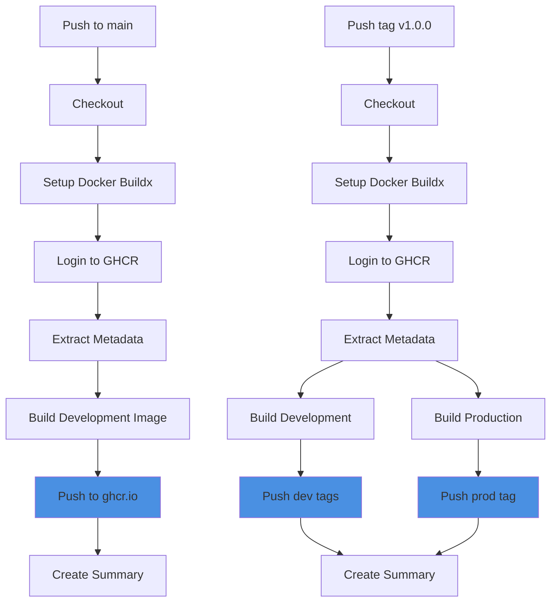

# 🐳 Workflow: Docker Build and Publish

## Descripción

Workflow que construye automáticamente imágenes Docker del proyecto y las publica en GitHub Container Registry (GHCR), permitiendo que cualquiera pueda usar el proyecto con un simple `docker pull`.

## Archivo

```
.github/workflows/docker-publish.yml
```

## Triggers

- **Push** a branch `main` → Build + Publish
- **Push** de tags `v*` → Build dev + prod
- **Pull Request** → Solo build (sin publish)
- **Manual** (`workflow_dispatch`) → On demand

## Variables de Entorno

```yaml
REGISTRY: ghcr.io
IMAGE_NAME: ${{ github.repository }}  # ivhuco/practica_ci_cd
```

## Jobs y Steps

### 1. Checkout Code

Descarga el código del repositorio

### 2. Set up Docker Buildx

Configura Docker Buildx para builds multi-plataforma y caché optimizado

### 3. Log in to GitHub Container Registry

```yaml
- uses: docker/login-action@v3
  with:
    registry: ghcr.io
    username: ${{ github.actor }}
    password: ${{ secrets.GITHUB_TOKEN }}
```

- Usa token automático de GitHub Actions
- No requiere configuración de secrets adicionales

### 4. Extract Metadata (tags, labels)

Genera tags automáticos basados en el contexto:

| Evento | Tags Generados |
|--------|----------------|
| Push a `main` | `latest`, `main-<sha>` |
| Tag `v1.2.3` | `v1.2.3`, `v1.2`, `v1`, `latest` |
| PR #42 | `pr-42` |

### 5. Build and Push Docker Image (development)

```yaml
- uses: docker/build-push-action@v5
  with:
    target: development
    push: ${{ github.event_name != 'pull_request' }}
    cache-from: type=gha
    cache-to: type=gha,mode=max
```

**Características:**

- Construye etapa `development` del Dockerfile multi-stage
- Usa caché de GitHub Actions para builds rápidos
- Solo hace push si NO es PR (para ahorrar almacenamiento)

### 6. Build Production Image

Solo se ejecuta en tags `v*`:

```yaml
if: startsWith(github.ref, 'refs/tags/v')
```

- Construye imagen optimizada de producción
- Tag: `prod-v1.0.0`

### 7. Create Summary

Genera resumen en GitHub Actions con:

- Registry y repositorio
- Tags creados
- Comandos de uso

## Duración Típica

- **Primer build:** ~4-6 minutos (descarga base images)
- **Builds subsecuentes:** ~1-2 minutos (con caché)

## Uso de las Imágenes

### Development (latest)

```bash
# Pull
docker pull ghcr.io/ivhuco/practica_ci_cd:latest

# Run interactivo
docker run -it --rm ghcr.io/ivhuco/practica_ci_cd:latest bash

# Entrenar modelo
docker run --rm \
  -v $(pwd)/models:/app/models \
  ghcr.io/ivhuco/practica_ci_cd:latest \
  python src/train.py
```

### Production (en tags)

```bash
docker pull ghcr.io/ivhuco/practica_ci_cd:prod-v1.0.0
docker run --rm ghcr.io/ivhuco/practica_ci_cd:prod-v1.0.0
```

## Visualización del Flujo



## Ver Imágenes Publicadas

### GitHub Packages

1. Ve a: <https://github.com/ivhuco/practica_ci_cd>
2. Click en "Packages" (sidebar derecho)
3. Selecciona `practica_ci_cd`
4. Ver todos los tags disponibles

### Command Line

```bash
# Listar tags (requiere gh CLI)
gh api /user/packages/container/practica_ci_cd/versions

# O visitar directamente
# https://github.com/ivhuco/practica_ci_cd/pkgs/container/practica_ci_cd
```

## Crear Nueva Versión

```bash
# Tag local
git tag -a v1.0.0 -m "Primera versión estable"

# Push tag (dispara workflow)
git push origin v1.0.0

# Resultado: Genera tags v1.0.0, v1.0, v1, latest, prod-v1.0.0
```

## Permisos

El workflow requiere:

```yaml
permissions:
  contents: read    # Leer código
  packages: write   # Escribir en GHCR
```

Estos permisos están configurados automáticamente en el workflow.

## Caché de Docker

El workflow usa GitHub Actions cache para:

- ✅ Acelerar builds subsecuentes
- ✅ Reducir tiempo de descarga de base images
- ✅ Reutilizar layers de Docker

```yaml
cache-from: type=gha
cache-to: type=gha,mode=max
```

## Solución de Problemas

### Error: "permission denied while trying to connect to Docker"

**Causa:** Docker Buildx no configurado correctamente  
**Solución:** El workflow ya incluye `docker/setup-buildx-action`

### Error: "denied: permission_denied: write_package"

**Causa:** Token sin permisos para escribir en GHCR  
**Solución:** Verificar que `permissions.packages: write` esté en el workflow

### Build muy lento

**Causa:** Caché no funcionando  
**Solución:**

```bash
# Verificar que cache-from y cache-to estén configurados
# GitHub Actions tiene límite de 10GB de caché total
```

### Imagen muy grande

**Solución:**

- Usar `.dockerignore` (ya incluido)
- Considerar multi-stage builds más agresivos
- Usar Python Alpine en vez de Python Slim

## Integración con Docker Compose

Los usuarios pueden usar las imágenes publicadas:

```yaml
# docker-compose.yml
services:
  train:
    image: ghcr.io/ivhuco/practica_ci_cd:latest
    # En vez de build: .
```

## Comparación con Otros Workflows

| Workflow | Trigger | Duración | Output |
|----------|---------|----------|--------|
| CI - Testing | Push/PR | ~50s | Test results |
| Train Model | Manual/Schedule | ~37s | Model artifact |
| Evaluate Model | After Train | ~44s | Metrics |
| **Docker Build** | **Push to main** | **~1m 42s** | **Docker image** |

## Recursos

- [Docker Build Push Action](https://github.com/docker/build-push-action)
- [Docker Login Action](https://github.com/docker/login-action)
- [Docker Metadata Action](https://github.com/docker/metadata-action)
- [GHCR Documentation](https://docs.github.com/en/packages/working-with-a-github-packages-registry/working-with-the-container-registry)
