# 📦 Módulo: Data Loader

## Descripción General

El módulo `data_loader.py` es responsable de gestionar la carga y guardado de datasets del proyecto. Proporciona una interfaz simple y consistente para acceder a los datos en diferentes etapas del pipeline.

## Ubicación

```
src/data_loader.py
```

## Responsabilidades

1. **Gestión de rutas**: Crear y mantener estructura de directorios
2. **Carga de datos**: Leer datos raw del Titanic
3. **Guardado de datos**: Persistir datos procesados
4. **Validación**: Verificar existencia de archivos

## Funciones Principales

### `get_data_paths()`

Obtiene las rutas de los directorios de datos y los crea si no existen.

**Firma:**

```python
def get_data_paths() -> tuple[Path, Path]
```

**Retorna:**

- `tuple`: (raw_data_path, processed_data_path)

**Ejemplo:**

```python
from src.data_loader import get_data_paths

raw_path, processed_path = get_data_paths()
print(f"Datos raw: {raw_path}")
print(f"Datos procesados: {processed_path}")
```

**Detalles de implementación:**

- Usa `Path(__file__).parent.parent` para obtener la raíz del proyecto
- Crea directorios con `mkdir(parents=True, exist_ok=True)`
- Retorna objetos `Path` de pathlib

---

### `load_titanic_data()`

Carga los datasets de entrenamiento y test del Titanic.

**Firma:**

```python
def load_titanic_data(
    train_path: Optional[str | Path] = None,
    test_path: Optional[str | Path] = None
) -> tuple[pd.DataFrame, Optional[pd.DataFrame]]
```

**Parámetros:**

- `train_path` (opcional): Ruta al archivo CSV de entrenamiento
- `test_path` (opcional): Ruta al archivo CSV de test

**Retorna:**

- `tuple`: (train_df, test_df)
  - `train_df`: DataFrame con datos de entrenamiento
  - `test_df`: DataFrame con datos de test o `None` si no existe

**Excepciones:**

- `FileNotFoundError`: Si el archivo de entrenamiento no existe

**Ejemplo básico:**

```python
from src.data_loader import load_titanic_data

# Cargar con rutas por defecto
train_df, test_df = load_titanic_data()

print(f"Train shape: {train_df.shape}")
print(f"Test shape: {test_df.shape if test_df is not None else 'N/A'}")
```

**Ejemplo con rutas custom:**

```python
from src.data_loader import load_titanic_data

train_df, test_df = load_titanic_data(
    train_path='mi_carpeta/mi_train.csv',
    test_path='mi_carpeta/mi_test.csv'
)
```

**Comportamiento:**

1. Usa rutas por defecto si no se especifican (`data/raw/train.csv`, `data/raw/test.csv`)
2. Verifica existencia del archivo de entrenamiento (obligatorio)
3. Intenta cargar test si existe (opcional)
4. Retorna DataFrames de pandas

---

### `save_processed_data()`

Guarda datasets procesados en el directorio correspondiente.

**Firma:**

```python
def save_processed_data(
    train_df: pd.DataFrame,
    test_df: Optional[pd.DataFrame] = None,
    val_df: Optional[pd.DataFrame] = None
) -> None
```

**Parámetros:**

- `train_df`: DataFrame de entrenamiento procesado (obligatorio)
- `test_df` (opcional): DataFrame de test procesado
- `val_df` (opcional): DataFrame de validación procesado

**Retorna:**

- `None`

**Efectos secundarios:**

- Crea archivos CSV en `data/processed/`:
  - `train_processed.csv`
  - `test_processed.csv` (si test_df no es None)
  - `val_processed.csv` (si val_df no es None)
- Imprime mensajes de confirmación

**Ejemplo:**

```python
from src.data_loader import save_processed_data
import pandas as pd

# Después del preprocesamiento
save_processed_data(
    train_df=X_train,
    val_df=X_val,
    test_df=X_test
)

# Output:
# Saved processed training data: 712 rows
# Saved processed test data: 179 rows
# Saved processed validation data: 179 rows
```

---

### `load_processed_data()`

Carga datasets previamente procesados.

**Firma:**

```python
def load_processed_data() -> tuple[
    pd.DataFrame,
    Optional[pd.DataFrame],
    Optional[pd.DataFrame]
]
```

**Parámetros:**

- Ninguno

**Retorna:**

- `tuple`: (train_df, test_df, val_df)
  - `train_df`: Datos de entrenamiento procesados
  - `test_df`: Datos de test procesados o `None`
  - `val_df`: Datos de validación procesados o `None`

**Ejemplo:**

```python
from src.data_loader import load_processed_data

train_df, test_df, val_df = load_processed_data()

if train_df is not None:
    print(f"Train loaded: {train_df.shape}")
if test_df is not None:
    print(f"Test loaded: {test_df.shape}")
if val_df is not None:
    print(f"Val loaded: {val_df.shape}")
```

**Comportamiento:**

- Intenta cargar cada archivo CSV si existe
- No lanza error si archivos opcionales no existen
- Retorna `None` para datasets no encontrados

## Flujo de Trabajo Típico

```python
from src.data_loader import (
    load_titanic_data,
    save_processed_data,
    load_processed_data
)
from src.preprocessing import preprocess_data

# 1. Cargar datos raw
train_raw, test_raw = load_titanic_data()

# 2. Preprocesar
processed = preprocess_data(train_raw, test_raw)

# 3. Guardar datos procesados
save_processed_data(
    train_df=processed['X_train'],
    val_df=processed['X_val'],
    test_df=processed['X_test']
)

# 4. En otro script, cargar datos procesados
train_df, test_df, val_df = load_processed_data()
```

## Diagrama de Flujo

```mermaid
graph TD
    A[Inicio] --> B{¿Datos raw existen?}
    B -->|No| C[Error: Ejecutar download_data.py]
    B -->|Sí| D[load_titanic_data]
    D --> E[train_df, test_df]
    E --> F[Preprocesamiento]
    F --> G[save_processed_data]
    G --> H[Archivos CSV en data/processed/]
    
    I[Otro script] --> J[load_processed_data]
    J --> K[Usar datos procesados]
    
    style C fill:#f99
    style H fill:#9f9
    style K fill:#9f9
```



## Gestión de Errores

### Error: Archivo de entrenamiento no encontrado

```python
# Error
FileNotFoundError: Training data not found at data/raw/train.csv.
Please run scripts/download_data.py first.
```

**Solución:**

```bash
python scripts/download_data.py
```

### Error: Permiso denegado al crear directorios

```python
# Error
PermissionError: [Errno 13] Permission denied: 'data/raw'
```

**Solución:**

```bash
# Verificar permisos del directorio
ls -ld data/

# Cambiar permisos si es necesario
chmod 755 data/
```

## Buenas Prácticas

### ✅ Hacer

```python
# Usar rutas por defecto
train_df, test_df = load_titanic_data()

# Manejar casos donde test_df puede ser None
if test_df is not None:
    # Procesar test_df
    pass

# Usar pathlib.Path para rutas
from pathlib import Path
custom_path = Path('mi_carpeta') / 'mi_archivo.csv'
```

### ❌ Evitar

```python
# No asumir que test_df siempre existe
test_df.shape  # Puede causar AttributeError

# No usar rutas relativas complejas
load_titanic_data(train_path='../../data/train.csv')  # Confuso

# No hardcodear rutas absolutas
load_titanic_data(train_path='/Users/usuario/proyecto/data/train.csv')  # No portable
```

## Personalización

### Cambiar ubicación de datos

Modifica las rutas en `get_data_paths()`:

```python
def get_data_paths():
    """Get paths for data directories."""
    # Cambiar ruta base
    project_root = Path('/mi/ruta/personalizada')  # En lugar de Path(__file__).parent.parent
    
    raw_data_path = project_root / 'datos_originales'  # En lugar de 'data' / 'raw'
    processed_data_path = project_root / 'datos_procesados'
    
    raw_data_path.mkdir(parents=True, exist_ok=True)
    processed_data_path.mkdir(parents=True, exist_ok=True)
    
    return raw_data_path, processed_data_path
```

### Soporte para diferentes formatos

Puedes extender para soportar otros formatos:

```python
def load_titanic_data_excel(train_path=None):
    """Cargar datos desde Excel."""
    raw_data_path, _ = get_data_paths()
    
    if train_path is None:
        train_path = raw_data_path / 'train.xlsx'
    
    train_df = pd.read_excel(train_path)
    return train_df
```

## Dependencias

```python
import os                    # Verificación de existencia de archivos
import pandas as pd          # Lectura/escritura de CSV
from pathlib import Path     # Gestión de rutas
```

## Testing

Tests relacionados se encuentran en:

```
tests/test_preprocessing.py  # Incluye tests de integración con data_loader
```

Ejemplo de test:

```python
def test_load_data():
    """Test de carga de datos."""
    train_df, test_df = load_titanic_data()
    
    assert train_df is not None
    assert len(train_df) > 0
    assert 'Survived' in train_df.columns
```

## Ver También

- [📄 preprocessing.py](PREPROCESSING.md) - Módulo que usa data_loader
- [📄 train.py](TRAIN.md) - Script que carga datos para entrenamiento
- [📜 download_data.py](../scripts/DOWNLOAD_DATA.md) - Script para descargar datos
- [🏗️ Arquitectura](../../ARQUITECTURA.md) - Visión general del sistema

## Referencias

- [pandas.read_csv](https://pandas.pydata.org/docs/reference/api/pandas.read_csv.html)
- [pathlib documentation](https://docs.python.org/3/library/pathlib.html)
